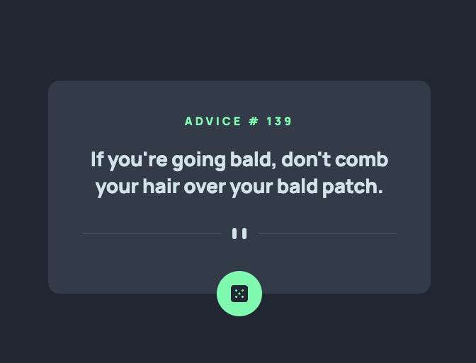

# 💻 Desafio Frontend Mentor | Advice generator App

<h1 align="center">
  
<h1>

##  🛸 O que foi utilizado nesse projeto
- ReactJS
- Vite
- CSS Modules

## 🪓 Como usar esse projeto
```bash
  # Clone o projeto
  $ git clone https://github.com/thiagobraddock/frontendmentor-advices.git
```
```bash
  # acesse o diretório
  $ cd frontendmentor-advices
```
```bash
  # Instale as dependências
  $ npm i
```
```bash
  # Execute a aplicação
  $ npm run dev
```